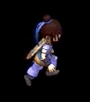

# 梦玛引擎（GPL开源协议）
## 英文名：Dremma Engine

### 游戏窗体

Game继承java.awt.canvas

> Canvas是AWT组件, JPanel是Swing组件，Swing组件是以AWT组件为基础的，从理论上来说，Canvas要比JPanel更轻量些。如果canvas能满足需求,就用canvas。

Game中包含JFrame frame，frame作为窗体，构建游戏主体

GameLauncher继承java.applet.Applet，支持引擎构建applet网页游戏

### 游戏帧数

游戏帧数指每秒渲染的画面张数，人眼上限为60帧，多余的渲染帧造成性能浪费，故本游戏引擎采用默认60帧的方案。计算每次游戏循环经过的纳秒数，若达到每秒60帧渲染一帧画面所需的纳秒数，则进行画面渲染，否则不进行画面渲染。由于1e9除以60.0是无限不循环小数，有一定误差，经测试，设置为60.0可以将游戏帧数稳定在59～61的范围内。

> 1s = 1e9ns = 1e3ms
>
> 1ms = 1e6ns

### 游戏调试

调试支持三种信息：绿色的信息INFO、黄色的警告WARNING以及红色的严重警告SERVER，在游戏开发时，打开调试，游戏发布时，将Game.debug设为false关闭调试信息。

如果开发者需要看到有颜色的文字，请在eclipse中安装ANSIconsole插件

> 该插件在线安装地址：http://www.mihai-nita.net/eclipse 
>
> Git：https://github.com/mihnita/ansi-econsole

### 渲染系统

BufferStrategy类：处理双缓存、翻页和显示器刷新等待，它会根据系统功能选择最佳的缓存方法。首先，尝试进行翻页，若无法翻页则尝试进行双缓存。另外，翻页之前需要等待显示器刷新完毕，限制每秒可以显示的帧数最多为75，这样就不能用游戏帧速率作为测试系统运行速度的基准。

使用getDrawGraphics()方法取得**绘图缓存区的图形描述表**，绘图完成后，调用show()方法显示绘图缓存区，这样就可以使用翻页，也可以将绘图缓存区复制到显示缓存区，实现代码如下：

~~~java
BufferStrategy strategy = frame.getBufferStartegy();
Graphics g = strategy.getDrawGraphics();
draw(g);
g.dispose();
strategy.show();
~~~

* 双缓存

  不断直接绘制屏幕会导致屏幕闪烁，当要用背景擦除角色，然后重画角色，在某个瞬间，可能在角色位置看到背景，由于一切发生得太快，所以会出现闪烁。避免出现闪烁可以使用双缓存技术，缓存区是绘图时使用的屏外内存区。使用双缓存不是直接绘制屏幕，而是绘制到后缓存区，然后将整个缓存区复制到屏幕上，这样就可以同时更新整个屏幕。

* 翻页

  使用双缓存的一个缺点是将后缓存区复制到屏幕上需要较长时间，以分辨率为800\*600，位深度为16，那么就需要800\*600\*2字节，即938K byte，这样每秒钟30帧要交换将近1M byte的内存，尽管复制如此大的内存量在许多游戏中也是相当快的，但如果不用复制缓存区，而能直接把后缓存区变成显示缓存区，那该多好。

  翻页技术使用显示指针解决这一问题，显示指针指向要显示的缓存区，大多数现代系统都可以改变这个显示指针。向后缓存区绘制完毕后，显示指针可以从当前显示缓存区切换到后缓存区上。当显示指针改变时，显示缓存区立即变为后缓存区，而后缓存区则会立即变成显示缓存区。改变指针比复制大块内存要快得多。

* 监视刷新与裂开

  显示器的刷新频率通常在75Hz左右，表示显示器每秒钟刷新75次，但如果显示器刷新途中发生翻页或者缓存区复制等操作，显示器将会同时显示一部分旧缓存区和一部分新缓存区，即发生裂开，为了解决这个问题，可以在显示器刷新完成之前翻页，在Java运行环境中可以使用BufferStrategy类完成该工作。

### 图形变换

~~~java
public void draw(Graphics2D g) {
  AffineTransform transform = new AffineTransform();
  transform.scale(2, 2); // 缩放
  transform.translate(400, 200); // 平移
  transform.rotate(Math.toRadians(90)); // 顺时针旋转90度
  transform.scale(-1, 1); // 镜像翻转
  g.drawImage(this.getImage(), transform, null);
}
~~~

### 事件监听

* 鼠标事件

* 键盘事件

* 窗体事件

### 音频播放

直接实现音频播放时，游戏帧数会下降到30-40帧

而使用多线程重构播放器后，帧数会重新恢复到60帧左右

经测试，解除shouldRender限制后

* 游戏在不进行任何音乐播放的情况下帧数为340-350
* 不使用多线程播放音乐，游戏帧数为30-40
* 使用多线程播放音乐，游戏帧数为280-290
* 最终解除了Thread.sleep休息的2ms，发现在不进行音乐播放的情况下帧数为470-630，多线程播放音乐的情况下达到了350-480，解除2ms、打开shouldRender的限制以后，惊喜地发现游戏帧数固定在了60帧

故使用多线程进行音乐播放可以在很大程度上优化音乐播放器性能

### 动画系统

* Animator
  * HashMap<String, Animation> animations哈希表
  * String类型的state，表示动画状态，可在外部修改当前动画状态
  * 提供无参构造函数以及深拷贝的拷贝构造函数
  * 可以向动画控制器中添加Animation，获取指定状态的动画
  * 循环播放当前状态动画
* Animation
  * 关键帧动画：AnimFrame数组frames
  * 维护当前帧在关键帧数组中的下标、当前动画播放时长及动画总时长
  * 提供无参构造函数及深拷贝的拷贝构造函数（用于预制体概念中的克隆）
  * 可向动画中添加关键帧：图像，该图像显示的时间长度
  * 支持从头开始播放本动画、根据播放的时长更新动画、获取当前图像、获取当前关键帧
* AnimFrame
  * 动画帧：记录图像和本图像播放的结束时间
  * 提供带参构造函数，使用时endTime即放入帧时的totalDuration

### 地图系统

地图系统涉及游戏中地图的加载，实体及场景的渲染，以及三种坐标系的坐标转换（世界坐标、屏幕坐标及地砖坐标）

* TileMap中保存静态 ArrayList\<Image\>tilesTable：地砖编号与地砖对应的表，在从文件中加载地图时使用

* Image\[\]\[\]数组tiles表示二维地图，每个成员为一块地砖

* HashMap<String, Entity> entities表示游戏中的其他实体，其他是指相对于Player的其他

* player游戏主角，可被玩家操控

* 渲染优先队列PriorityQueue\<Entity\> renderEntities;
* 提供带参构造函数，传入地砖x轴方向的数量width，y轴方向的数量height
* 可通过getWidth()，getHeight()获取地砖在各方向上的个数
* 通过gitTile获取指定地砖坐标的地砖
* 通过setTile设置指定位置的地砖
* 通过getPlayer、setPlayer获取、设置游戏主角对象
* 通过addEntity、removeEntity添加实体到地图中或从地图中删除实体
* 取得所有实体（除主角对象外）的迭代器
* 通过loadTiles向tilesTable中填入数据（地砖图片，将自动编号），如果已经存在则丢弃
* loadTileMap方法根据文件中的地砖编号加载地图
* 通过addEntity(Entity srcEntity, **int** tileX, **int** tileY)方法克隆srcEntity并添加至地砖坐标为(tileX，tileY)的地方
* 通过draw方法渲染地图，先绘制地砖，再绘制实体渲染队列

#### 渲染顺序

* 使用内部为二叉堆的优先队列实现，在TileMap中维护渲染优先队列

  ~~~java
  PriorityQueue<Entity> renderEntities; // 渲染优先队列
  
  // 规定优先级
  renderEntities = new PriorityQueue<Entity>(1, new Comparator<Entity>() {
    
    @Override
    public int compare(Entity o1, Entity o2) {
      // 解决人树问题，图像底部纵坐标小的实体优先渲染
      return FloatCompare.isLess(o1.getBottom(), o2.getBottom()) ? -1 : 1;
    }
  
  });
  
  // 向实体渲染队列中添加游戏主角
  renderEntities.add(player);
  
  // 向实体渲染队列中添加其他实体
  Iterator<Entry<String, Entity>> entitiesIterator = TileMap.getEntitiesIterator();
  while (entitiesIterator.hasNext()) {
    HashMap.Entry<String, Entity> entry = (HashMap.Entry<String, Entity>) entitiesIterator.next();
    renderEntities.add(entry.getValue());
  }
  
  // 渲染优先队列
  while(!renderEntities.isEmpty()) {
    renderEntities.peek().draw(g);
    renderEntities.remove(renderEntities.peek());
  }
  ~~~

### 碰撞检测系统

维护游戏场景中所有的碰撞盒到哈希表（String表示碰撞盒名称）HashMap<String, CollisionBox> **collisionBoxs**中，方便在任意地方添加或修改碰撞盒

* 每个碰撞盒由两个点确定（左上点及右下点）

* 碰撞盒默认不为触发器模式，若要设置触发器，将isTrigger置为true即可

* 可通过getWidth、getHeight获取碰撞盒的宽度、长度

* 可通过静态boolean shouldRender控制是否渲染碰撞盒到屏幕上以方便调整，默认为false

  * 碰撞盒的绘制：如果使用默认的g.drawRect绘制碰撞盒，则必须传入整数坐标，为了支持浮点数坐标（**为什么要支持浮点数坐标呢？因为我的Player每帧移动speed*Time.deltaTime，而Time.deltaTime的值很小，如果使用整数粗略地绘制，就无法看到较好的碰撞盒跟随游戏主角移动的效果**），这里主要使用g.drawImage(image, affineTransform, observer)方法，affineTransform支持对图片进行浮点数坐标的平移与放大。我的方法是提供两张只有一个像素点的图片

    * 半透明的碰撞盒内部
    * 不透明的碰撞盒边框及调整点

    

    * 根据碰撞盒的两个定位点绘制collisionBox，使用affineTranform的translate和scale进行平移和放大；同理使用border绘制边框和两个调整点

* 可点击屏幕中碰撞盒的左上或右下点进行调整，点击后该点跟随鼠标移动，当再次点击时，该点调整完毕，打印调整后的坐标信息，可通过参考该信息修改碰撞盒位置

  * 这里遇到了一个bug：由于我的鼠标事件监听系统的实现机制是在按键为按压状态时获取到的isPressed为true，就导致如果仅仅判断鼠标是否按压了的话就会触发很多次该判断，而我需要按一下跟随，按一下停止，显然通过这个是办不到的，后来我发现虽然isPressed状态在帧数较高情况下会触发多次，但是pressedTime变量确实只会按压一次增长1，于是我想到去判断pressedTime为奇数还是偶数，当按压后pressedTime为奇数时，进入跟随，偶数时则停止，这个办法在按压正确位置上时呈现效果上还行，但如果按压到除了调整碰撞盒的点以外的地方就会出现问题，比如当我点击别处一下时再点击碰撞盒调整点，此时pressedTime为偶数（2次），应该停止，就没法成功跟随了，故该方法不行；后来我开始考虑是否可以通过维护点击碰撞盒调整点之前的鼠标按压次数来解决这个问题，比如我之前按了3次，那么在点击到碰撞盒调整点时是第3+1次进行跟随，第3+2次则进行停止，这个办法看似可行，但尝试时发现，我没法维护到这个**点击碰撞盒调整点之前的鼠标按压次数**，如果非要维护这个量，我必须排除点击到碰撞盒调整点时的次数，那就要判断游戏中所有的碰撞盒的调整点是否被按压，非常浪费性能；于是我想到我不需要维护除掉所有的碰撞盒的调整点其他位置的按压次数，我可以维护按压到碰撞盒调整点时的按压次数，跟随后点击一次必然停止，故我记录跟随后的按压次数，判断需要停止时当前鼠标按压次数是否比我记录的值大1，如果是则进行停止，停止后记录一下当前鼠标按压次数，再到跟随时判读当前鼠标按压次数是否比我的记录值大1，这个方案可以达到这样的效果：开始时点击调整点，此时当前鼠标按压次数为1，记录值为0，满足跟随条件，进入跟随，记录值等于当前鼠标按压次数等于1，**将isChoosenLeftUp置为true，不进行跟随检查**；调整完再次按压，当前鼠标按压次数为2，记录值为1，满足停止条件，进入停止，记录值为2，**将isChoosenLeftUp置为false，不进行停止检查**，再次按压调整点，将重复上述，区别只是鼠标按压次数增长，本方案可以在按压正确的情况下解决这个问题，但是如果停止后点击其他地方，导致记录值与当前鼠标按压次数的差距大于1，将无法进入跟随或者停止，此时与正确的解决方案已经很接近了，最终的办法就是将比较条件改成当前鼠标按压次数大于记录值，这样无论怎么点击其他地方，都不会对调整碰撞盒造成影响。

* 碰撞探测部分

  * 为了优化，只对移动的实体进行碰撞检测

  * 遍历所有碰撞盒，根据碰撞盒名称得到它在地图中的实体，如果该实体的移动向量不为Vector2.zero()（即实体将发生移动），则进行碰撞检测

  * 遍历其他实体

    * 在碰到的碰撞盒为非触发器的模式下，获取当前碰撞盒移动后的下一个碰撞盒，当**当前碰撞盒与其他实体碰撞盒没有相交部分，而移动后的碰撞盒与该其他实体有相交部分**时，碰撞发生，此时本实体回退**移动后的碰撞盒相较移动前增长的部分**，保证不穿模
  * 在碰到的碰撞盒为触发器模式下，只考虑当前碰撞盒是否与其他实体有相交部分，若有，则触发
  
* 碰撞探测部分用到了检测两个矩形是否相交的方法，我共想到三种实现方案，本引擎采用我想到的最优方案
  
  1. 遍历一个矩形内的所有像素点，检查该点是否位于另一矩形内，时间复杂度为O(m*n)
  
  2. 每个矩形四个角的点坐标已知，得出两个坐标轴方向的向量，计算向量的长度，两个矩形的x轴方向向量（仅考虑x轴，y都为0）长度相加与两个矩形中的最小x、最大x构成的向量长度相比较，如果最小x、最大x构成的向量长度小于等于两个矩形的x轴方向向量长度相加则x轴方向满足，同理计算y轴方向，若都满足，则发生了相交，这个方法与我最终采用的方法很像，但存在区别，就是本方法使用到坐标相减求向量，求向量长度（要开方，不能使用sqrMagnitude，因为涉及长度相加）等，会导致计算量较大，Vector2类型需要垃圾回收机制处理，有一定性能浪费，时间复杂度为O(1)
  
  3. **最终采用的方法**，时间复杂度为O(1)
  
     分两个方向考虑：
  
     x轴方向分别获取两个矩形的长度及总的x轴方向的长度
  
     `总的x轴方向的长度<=获取两个矩形的长度之和`
  
       y轴同理，当都满足时说明两个矩形一定有相交部分
  
       ~~~java
       private boolean isIntersected(CollisionBox anotherCollisionBox) {
       		float thisXMin = this.leftUpPoint.x;
       		float thisXMax = this.rightDownPoint.x;
       		float thisYMin = this.leftUpPoint.y;
       		float thisYMax = this.rightDownPoint.y;
       
       		float anotherXMin = anotherCollisionBox.leftUpPoint.x;
       		float anotherXMax = anotherCollisionBox.rightDownPoint.x;
       		float anotherYMin = anotherCollisionBox.leftUpPoint.y;
       		float anotherYMax = anotherCollisionBox.rightDownPoint.y;
       
       		float xMin = Math.min(thisXMin, anotherXMin);
       		float xMax = Math.max(thisXMax, anotherXMax);
       		float yMin = Math.min(thisYMin, anotherYMin);
       		float yMax = Math.max(thisYMax, anotherYMax);
       		
       		if (FloatCompare.isLessOrEqual(xMax - xMin, thisXMax - thisXMin + anotherXMax - anotherXMin)
       				&& FloatCompare.isLessOrEqual(yMax - yMin, thisYMax - thisYMin + anotherYMax - anotherYMin)) {
             return true;
           }
         return false;
       }
       ~~~

# DremmaSandbox

基于DremmaEngine开发的游戏，展现本游戏引擎的易用性

绘制两个矩形

## 音乐播放模块在Sandbox中用法

支持的文件格式有`wav，au，和aiff`

~~~java
package priv.sandbox.game;

import priv.dremma.game.Game;
import priv.dremma.game.audio.AudioManager;
import priv.dremma.game.util.Resources;

@SuppressWarnings("serial")
public class Sandbox extends Game {
	
	public void onStart() {
		this.setName("SandBox");
		
		Resources.load(Resources.ResourceType.Music, "backgroundMusic", "res/music/background.wav");
		Resources.load(Resources.ResourceType.Music, "moneySound", "res/music/money.wav");
	}

	public void onUpdate() {
		AudioManager.getInstance().playOnce("moneySound");
		AudioManager.getInstance().playLoop("backgroundMusic");
	}

}
~~~
